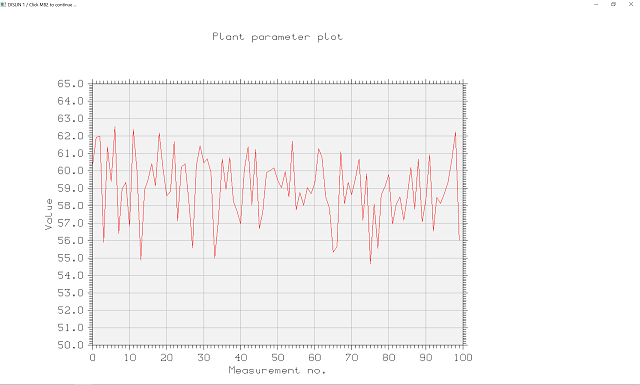

# Пример использования DISLIN для учебной практики

*Студентам кафедры «Управления и интеллектуальных технологий» НИУ «МЭИ».*

DISLIN — простая библиотека, чтобы построить график временного ряда,
которая сама нарисует заголовок, оси, сетку, легенду.

1. [На странице загрузок][dislin] выберите версию для 32 или 64 бит.

    Важна не версия системы, а разрядность компилируемой программы.
    По умолчанию с CodeBlocks идет компилятор 32-битных программ mingw32,
    он же устанавливается по инструкции для РПОСУ. Используемый компилятор
    можно увидеть в *Build log* при сборке программы. Если там mingw64,
    значит, компилятор 64-битный.

2. В таблице загрузок выберите вариант «gcc, g++, gfortran Mingw32»
    (Mingw64 для 64-битной версии). На май 2020 это `dl_11_mg.zip`.

3. Создайте папку `dislin` в каталоге проекта, распакуйте в нее:

    * для 32-битной версии: `discpp.h` и `discpp51.a`;
    * для 64-битной версии: `discpp.h` и `discpp.a`.

4. *Project → Build options...* (`practice.cbp` уже настроен для 64 бит):

    * *Compiler options → Include directories:*
        *Add,* ввести `dislin`, *OK.*

    * *Linker settings:*

        *Add,* ввести `dislin\discpp.a` (или `dislin\discpp51.a`), *OK.*
        *Add,* ввести `gdi32`, *OK.*
        *Add,* ввести `opengl32`, *OK.*

      Библиотеки `gdi32` и `opengl32` поставляются в составе MinGW.
      Они всегда *32, в том числе для 64-битной библиотеки.

При успешной сборке после запуска проект-пример рисует такой график:

Подробнее о подключении библиотек читайте [ЛР № 4, часть 1][lab4.1]
курса РПОСУ. В данном случае применяется статическая компоновка.

[dislin]: https://www.mps.mpg.de/dislin/distributions
[lab4.1]: http://uii.mpei.ru/study/courses/cs/lab04/part1.html
